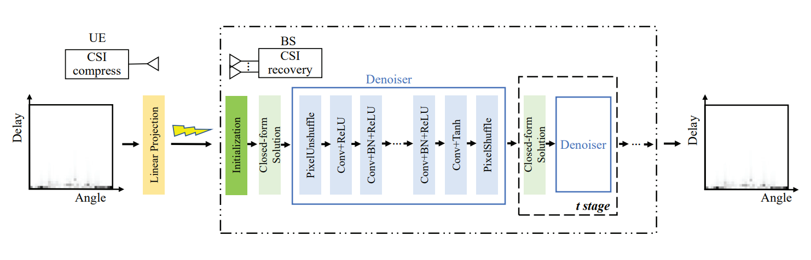

# CSIPPPNet: A One-Sided One-for-All Deep Learning Framework for Massive MIMO CSI Feedback

**The code of "Deep Plug-and-Play Prior for Multitask Channel Reconstruction in Massive MIMO Systems" [[IEEE]](https://ieeexplore.ieee.org/abstract/document/10445236) is available on https://github.com/wc253/PNPMT, which employs a common deep plug-and-play prior model for three channel reconstruction tasks. The novel proposed method greatly reduces the overhead of model training and storage.** If our work is helpful for your research, we would hope you give us a star and citation. Thanks!

This repository contains the implementation code for paper:

**1. CSI-PPPNet: A One-Sided One-for-All Deep Learning Framework for Massive MIMO CSI Feedback [[IEEE]](https://ieeexplore.ieee.org/abstract/document/10367817)**  
**2. Deep Learning for CSI Feedback: One-Sided Model and Joint Multi-Module Learning Perspectives [[arXiv]](https://arxiv.org/abs/2405.05522)**
## Abstract

To reduce multiuser interference and maximize the spectrum efficiency in orthogonal frequency division duplexing massive multiple-input multiple-output (MIMO) systems, the downlink channel state information (CSI) estimated at the user equipment (UE) is required at the base station (BS). This paper presents a novel method for massive MIMO CSI feedback via a one-sided one-for-all deep learning framework. The CSI is compressed via linear projections at the UE, and is recovered at the BS using deep learning (DL) with plug-and-play priors (PPP). Instead of using handcrafted regularizers for the wireless channel responses, the proposed approach, namely CSI-PPPNet, exploits a DL based denoisor in place of the proximal operator of the prior in an alternating optimization scheme. In this way, a DL model trained once for denoising can be repurposed for CSI recovery tasks with arbitrary compression ratio. The one-sided one-for-all framework reduces model storage space, relieves the burden of joint model training and model delivery, and could be applied at UEs with limited device memories and computation power. Extensive experiments over the open indoor and urban macro scenarios show the effectiveness and advantages of the proposed method.

<p align="center">
     <br>
</p>

## Dependencies
* tensorflow (>=2.5)
* numpy
* argparse
* scipy

## Overview

* `data_npz/` contains "random_matrix.npz" and CSI datasets for indoor and UMa scenarios.
* `utils/` contains several functional files which are "util_metric.py", "util_module.py", "util_norm.py" and "util_pnp.py".
* `model_zoo/` contains two well-trained deep learning models ("ffdnet_lr0.0001_b8_lnmse_nnone_w1e-06_d0.0_indoor_power_norm.h5" and "ffdnet_lr0.0001_b8_lnmse_nnone_w1e-06_d0.0_uma_power_norm.h5") for indoor and UMa scenarios.
* `pnpcf_indoor_svd_power_norm.py` and `pnpcf_uma_svd_power_norm.py` are the executable python files with possible arguments. Now, you are ready to run any *.py to get the results (i.e., CSIPPPNet in our paper).

## Install

### Indoor CSI dataset

We provide a [Netdisk](https://pan.baidu.com/s/18mQ6HaVDpnd0Cejrjkl5WA?pwd=uapp) to download the indoor CSI dataset. Users can download this dataset and put it into `./data_npz/`.

### UMa CSI dataset

We provide a [Netdisk](https://pan.baidu.com/s/1YIEbq-gdmsISqk9osCn2Jw?pwd=xz1g) to download the UMa CSI dataset. Users can download this dataset and put it into `./data_npz/`.

### Random matrix

We provide a [Netdisk](https://pan.baidu.com/s/1eR5vvFQ-5D0zMl0U_7KrhA?pwd=h14t) to download the random matrix used in our experiment. Users can download this dataset and put it into `./data_npz/`.

## Citation

If you are interested in our repository and our paper, please cite the following paper:

```
@article{chen2023csi,
  title={CSI-PPPNet: A One-Sided One-for-All Deep Learning Framework for Massive MIMO CSI Feedback},
  author={Chen, Wei and Wan, Weixiao and Wang, Shiyue and Sun, Peng and Li, Geoffrey Ye and Ai, Bo},
  journal={IEEE Transactions on Wireless Communications},
  year={2023},
  publisher={IEEE}
}

@article{guo2024deep,
  title={Deep Learning for CSI Feedback: One-Sided Model and Joint Multi-Module Learning Perspectives},
  author={Guo, Yiran and Chen, Wei and Sun, Feifei and Cheng, Jiaming and Matthaiou, Michail and Ai, Bo},
  journal={arXiv preprint arXiv:2405.05522},
  year={2024}
}
```
